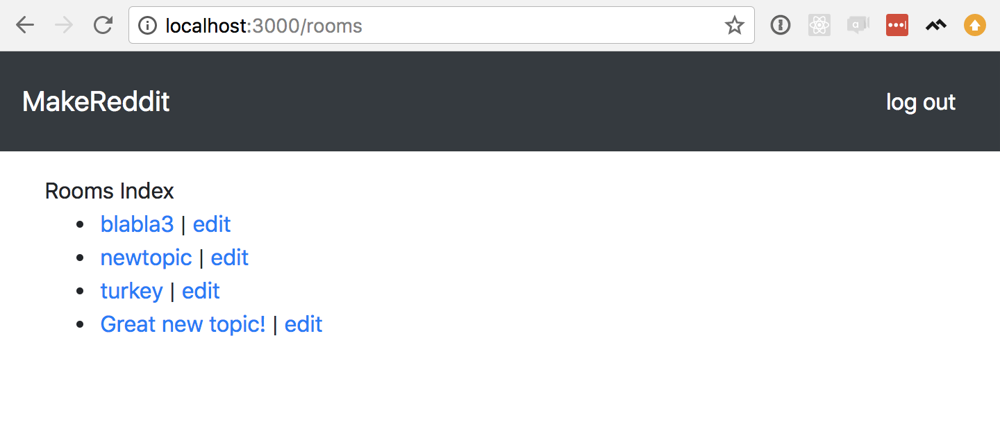

# What is a Web App?

In an earlier tutorial, we learned what a _web page_ is. A bunch of web pages together make up a _web site_. For example, the web site for a small restaurant might have a landing page, a menu page, and a 'Contact Us' page–all together, that's their website.

A _web app_ is the next step up from a web site. Like a web site, it's made of many web pages, but unlike a simple web site, a web app is backed by a server that can perform complex tasks, and probably a database. Google and Facebook are examples of web apps. The most distinguishing feature of web apps is that their web pages are _dynamically_ generated (as opposed to static HTML).  When you open your Facebook Feed and see a bunch of posts, there's not a person sitting somewhere typing up all of the HTML–it's made of templates that are filled in and combined to make web pages.

## What You Should Already Know

Before starting this tutorial, you should be familiar with HTML, CSS, and Basic Javascript. If you've completed the first five tutorials in this series, you're good.

# What We're Building

In this tutorial, we'll build a clone of the popular discussion website [Reddit](https://www.reddit.com/).

<!-- TODO: a little more description and a screenshot -->

# What You'll Learn

By the end of this tutorial, you will:

- set up and configure an Express web server
- use Mongoose and MongoDB to store information in a database
- set up a username/password authentication system
- learn about the MVC architecture for organizing your code
- learn about the REST style of organizing your URLs

# If You Get Stuck

"Sometimes, magic is just someone spending more time on something than anyone else might reasonably expect." - Teller (Penn & Teller)

Getting stuck when coding (and debugging) is a natural part of the programming process. If you find yourself stuck on a problem or lost, pause for a moment and take a breath. Maybe take a walk. Then retrace your steps (in the tutorial, not the walk.) Make sure you've followed each step of the tutorial. It's easy to make typos or accidentally skip over important steps.
