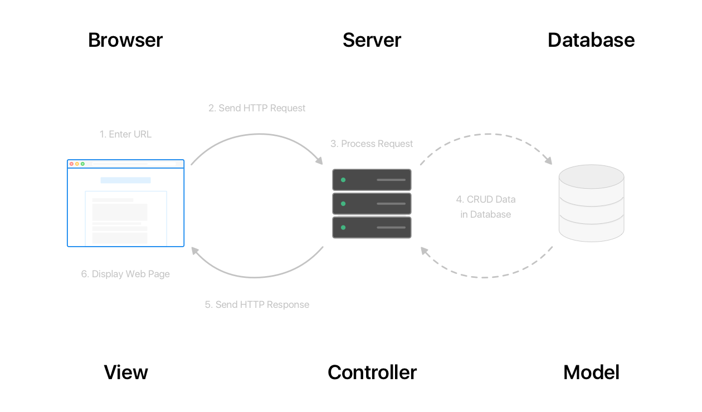
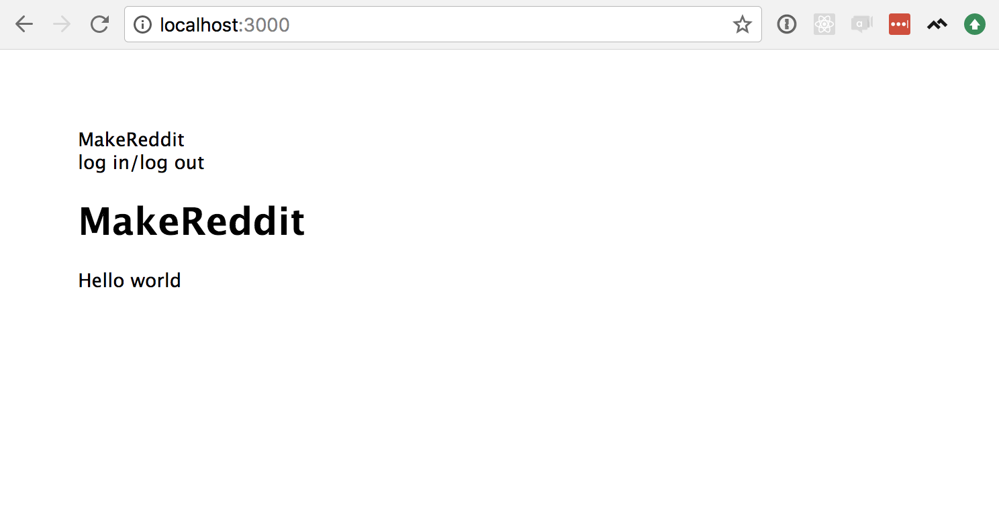

In this section, we're going to:
- Learn about MVC application architecture
- Set up a web server using Node and Express
- Generate HTML using Handlebars
- Make it look good using Bootstrap.

## MVC

Before we dive in, it's helpful to think about the big picture and understand how these tools work together.  We're going to build our app using an architecture called Model-View-Controller (MVC).

Under the MVC architecture, we think of our app as having three main systems that work together:

  - The View is the part of our app the user sees and clicks on. In a web app, this is usually the HTML pages displayed in a user's browser.
  - The Model is the part where we store information and define behavior for all of the objects in our database. For example, when a user registers a new account on our app, the Model is responsible for storing their name, email address and password in the database.
  - The Controller is the part in between–the code that gets information from the Models and sends it to the Views, and takes information from the Views and gives it to the Models. The Views and Models rarely communicate directly; the Controller manages their interactions.

You've already learned about the components of a web app – a browser, a server and a database. The diagram below shows how those parts work with MVC:



In this tutorial, all of the code we write will belong to one of these three domains. In Part 1, we won't work with Models very much–we need a database for that, and we'll set that up in Part 2. We will get a good introduction to Views, and a brief introduction to Controllers (which are called "Routers" in Express).

# Express

HTTP is the language of the web, and a web server is basically a machine that can receive an HTTP _request_ and return an HTTP _response_ (we'll learn more about HTTP in Part 4). What happens between receiving the request and sending the response can be dead simple or insanely complicated – it all depends on the situation. A very simple web server might only return static HTML files, and in that simple case Node.js would be good enough to develop your whole web server. But, as we start to add more complex functions like writing to a database, logging users in and out, writing posts, etc... we'll need some more powerful tools...

<!-- TODO: explain static html in info box, and italicize -->

Enter [Express](https://expressjs.com/). It is by far the most popular web server framework in the Node ecosystem, and it's going to provide us with a lot of the basic functions we need to develop our app. For example: setting up _dynamically-rendered_ HTML templates (we're going to make our HTML write itself!); organizing all of the URLs users can visit to see different pages; providing helper methods to set up and connect to databases; create error messages; and so much more...

## Express Generator

Express is "unopinionated", which means we can organize the files in our code however we want. Express has very few requirements in terms of what our files and directories are called, or how they work together; it doesn't matter how many files we have, or even how they work together.

However, some structure can be helpful for getting started.  There are lots of apps and packages to help you start a new project (see examples in the "Further Reading" section at the bottom of this page). For this tutorial, we're going to use the Express team's recommended tool, [Express Generator](https://expressjs.com/en/starter/generator.html).

The following instructions assume you already have Node and NPM installed on your computer.

>[action]
>
Open your terminal and enter:
>
```
npm install express-generator -g
```
>
The `-g` option tells NPM to install the package globally.

<!--  -->

>[action]
>
After it's installed, enter:
>
```
express --view=hbs makereddit
```
>
The `--view=hbs` option means that we want to use a package called [Handlebars](http://handlebarsjs.com/) for our Views–but we'll learn more about that in the section below. Express Generator has a ton of other options to configure new apps. To see for yourself, enter `express -h`.

When it's finished, you'll see the following instructions:

```
install dependencies:
     $ cd makereddit && npm install
```

>[action]
>
Enter `cd makereddit && npm install` to change directories and install dependencies.

## Directory Structure and Important Files

Now we have a template for a basic MVC web app. Open the `makereddit` folder in your favorite text editor, and let's have a look at what's there...


 Our Models, Views and Controllers will all live in this directory. The `views/` folder is there already. Our Controllers are there too, but Express-Generator calls them 'Routes', and they live in the `routes/` folder. Our Models don't have a place here yet, but soon we'll add another folder for them called `models/`.

 Everything else is mostly configuration, dependencies, and auto-generated system files. A couple of particularly important files: `package.json` is where we keep basic, low-level configuration options like the name of our app, the version, and – most importantly – our dependencies. `app.js` holds setup and configuration related to Express and, later, our database. Take a minute to look through these files–don't expect to understand everything in them, but you can start to get familiar with what these files look like.

## Hello World

Let's start with the `views/index.hbs` file.  Soon we'll learn more about what an `.hbs` file is and how it works, but for right now it's enough to understand that this is our "home page". This is the page that most people will see first when they visit our website.

>[action]
>
Let's open `views/index.hbs`, and change `Welcome to {{title}}` to `Hello, world`, so that our file looks like this:
>
```HTML
<h1>{{title}}</h1>
<p>Hello, world</p>
```

Now, start the server by entering `npm start` into your terminal. Then open your web browser and go to `localhost:3000`.  You should see something like this:


Congratulations! You just built a web app! We've still got some work to do before it does anything useful, but we've taken our first big step.

## Nodemon

Let's add one more useful tool before we move on. Let me demonstrate a small problem:  

We just want our website to say "hello, world" so we know it's working, but the biggest letters on the page actually say "Express".  If we look back at our code in `views/index.hbs` it seems to be coming from the `<h1>{{title}}</h1>`. But what are those curly braces for? And how does it know `title` is supposed to be "Express"?

This feature comes from Handlebars (which is why these files end with `.hbs`).  We'll learn about Handlebars in more detail in the next section, but for now let's just make that `title` be "Hello, world", instead of "Express".

>[action]
>
First, open `/routes/index.js`. Lines 5-7 should look like this:
>
```Javascript
router.get('/', function(req, res, next) {
  res.render('index', { title: 'Express' });
});
```
>
We're going to learn all about routes (or _controllers_) in parts 3 and 4, so don't worry if this still seems mysterious–soon, it won't. This just tells our web server that when anybody visits the root path of our website, or the home page, it should render a file called 'index' (`/views/index.hbs`!), and then it assigns the value `'Express'` to the key `title`.
>
Let's change that 'title' to 'Hello, world', so that the entire `/routes/index.js` file looks like this:
>
```Javascript
var express = require('express');
var router = express.Router();
>
/* GET home page. */
router.get('/', function(req, res, next) {
  res.render('index', { title: 'Hello, world' });
});
>
module.exports = router;
```

Now–be sure to save your file!–then, let's go back to the browser and hit refresh.  And:


😳

Unfortunately, Express only reads these files _when it starts_.  After that, it ignores any changes we make. One quick fix is to simply restart the server:
- Go to the terminal where the server is running
- Hit `control` + `c` on your keyboard. (This is a very common command for stopping command line programs)
- enter `npm start` to restart the server

Now when we refresh the page:


😌

But it's a huge pain if we have to stop and restart the server after every. single. little. change.  Luckily, there are lots of packages that will take care of restarting the server for us. As you grow as a developer, you'll eventually learn about tools like [Webpack](https://webpack.js.org/) or [Yarn](https://yarnpkg.com/en/).  But for this project, we're going to use a super simple solution called [nodemon](https://nodemon.io/) (short for "Node Monitor").

>[action]
>
First, open your terminal and enter:
>
```
npm install -g nodemon
```
>
(the `-g` means we're installing it globally, so it's available anywhere on your system, not just for this project)

Now, instead of typing `npm start`, we'll type `nodemon start`.  Go ahead:  use `control`+`c` to stop the running server, then enter:

```
nodemon start
```

Now in our `routes/index.js` file, let's set the title on our home page to be our real title, "MakeReddit":

```Javascript
router.get('/', function(req, res, next) {
  res.render('index', { title: 'MakeReddit' });
});
```

Now, **without** restarting the server, let's go to the browser and refresh the page:


😄

# Handlebars and Bootstrap

## Layout File

Remember what we learned about HTML in previous tutorials, and then let's look back at `views/index`:

```HTML
<h1>{{title}}</h1>
<p>Hello world</p>
```

What's missing?  This isn't a complete HTML document... Let's open the `views/layout.hbs` file.  At first, it should look like this:

```HTML
<!DOCTYPE html>
<html>
  <head>
    <title>{{title}}</title>
    <link rel='stylesheet' href='/stylesheets/style.css' />
  </head>
  <body>
    {{{body}}}
  </body>
</html>
```

Here's all the missing parts from `views/index.hbs`. This layout file is special because it will load with every page in our app. The contents of `index.hbs` are rendered in place of `{{{body}}}`.

<!-- TODO: elaborate, including example with wireframes would be nice -->

## Adding a Navbar

Let's add a navigation bar that will load at the top of every page in our app. Because we want it on _every_ page, it needs to go in our layout.

>[action]
>
Open `views/layout.hbs`, and replace its contents with the following:
>
```HTML
<!DOCTYPE html>
<html>
  <head>
    <title>{{title}}</title>
    <link rel='stylesheet' href='/stylesheets/style.css' />
  </head>
  <body>
    <nav>
      <div>
        MakeReddit
      </div>
>
      <div>
        log in/log out
      </div>
    </nav>
>
    <main>
      {{{body}}}
    </main>
  </body>
</html>
```
>
Our navigation bar is everything between the `<nav>...</nav>` tags. We're starting really simple; we just want the name of our app on the top left of every page, and a log in/log out link on the top right. We won't actually _implement_ logging in and out until part 3, so for now there's just some placeholder text, "log in/log out".
>
The other detail we're adding is wrapping `{{{body}}}` in `<main>...</main>` tags. That's not going to make a big visible change, but it's good practice to use [HTML5 semantic tags](https://developer.mozilla.org/en-US/docs/Web/HTML/Element).

<!-- TODO: primer/review on HTML5 tags -->

<!-- TODO: include wireframe -->

Now, let's check out that new nav bar:



hmm... That's obviously not great. Let's add some styling.

## Bootstrap

[Bootstrap](https://getbootstrap.com/) is a really popular toolkit for CSS and Javascript (though for this tutorial we'll only use its CSS options). There are [a few different ways to install bootstrap](https://getbootstrap.com/docs/4.0/getting-started/introduction/), but the simplest is to have users' browsers get it directly from Bootstrap's servers.

>[action]
>
Paste the following code inside the `<head>...</head>` tags of `views/layout.hbs`:
>
```HTML
<!-- Required meta tags -->
<meta charset="utf-8">
<meta name="viewport" content="width=device-width, initial-scale=1, shrink-to-fit=no">

<!-- Bootstrap CSS -->
<link rel="stylesheet" href="https://maxcdn.bootstrapcdn.com/bootstrap/4.0.0/css/bootstrap.min.css" integrity="sha384-Gn5384xqQ1aoWXA+058RXPxPg6fy4IWvTNh0E263XmFcJlSAwiGgFAW/dAiS6JXm" crossorigin="anonymous">
```

And that's it. Bootstrap is installed. To use it, we just need to add the correct classes to our HTML. Bootstrap provides a complete set of pre-styled components, and we want to use their [navbar](https://getbootstrap.com/docs/4.0/components/navbar/). According to those instructions, we'll update out `<nav>` and `<div>` tags as below.

>[action]
>
Update your `views/layout.hbs` file to match the following:
>
```HTML
<!DOCTYPE html>
<html>
  <head>
    <!-- Required meta tags -->
    <meta charset="utf-8">
    <meta name="viewport" content="width=device-width, initial-scale=1, shrink-to-fit=no">

    <!-- Bootstrap CSS -->
    <link rel="stylesheet" href="https://maxcdn.bootstrapcdn.com/bootstrap/4.0.0/css/bootstrap.min.css" integrity="sha384-Gn5384xqQ1aoWXA+058RXPxPg6fy4IWvTNh0E263XmFcJlSAwiGgFAW/dAiS6JXm" crossorigin="anonymous">
>
    <title>{{title}}</title>
    <link rel='stylesheet' href='/stylesheets/style.css' />
  </head>
  <body>
    <nav class="navbar navbar-dark bg-dark">
      <div class="navbar-brand">
        MakeReddit
      </div>
>
      <div class="navbar-text">
        log in/log out
      </div>
    </nav>
>
    <main>
      {{{body}}}
    </main>
  </body>
</html>
```

And then let's check out our nav bar at `localhost:3000`:


# Summary

In this section, we set up Node and Express to provide a web server and configured it to display a basic web page.

In the next section, we'll connect our server to a database and use it to store user account data.
