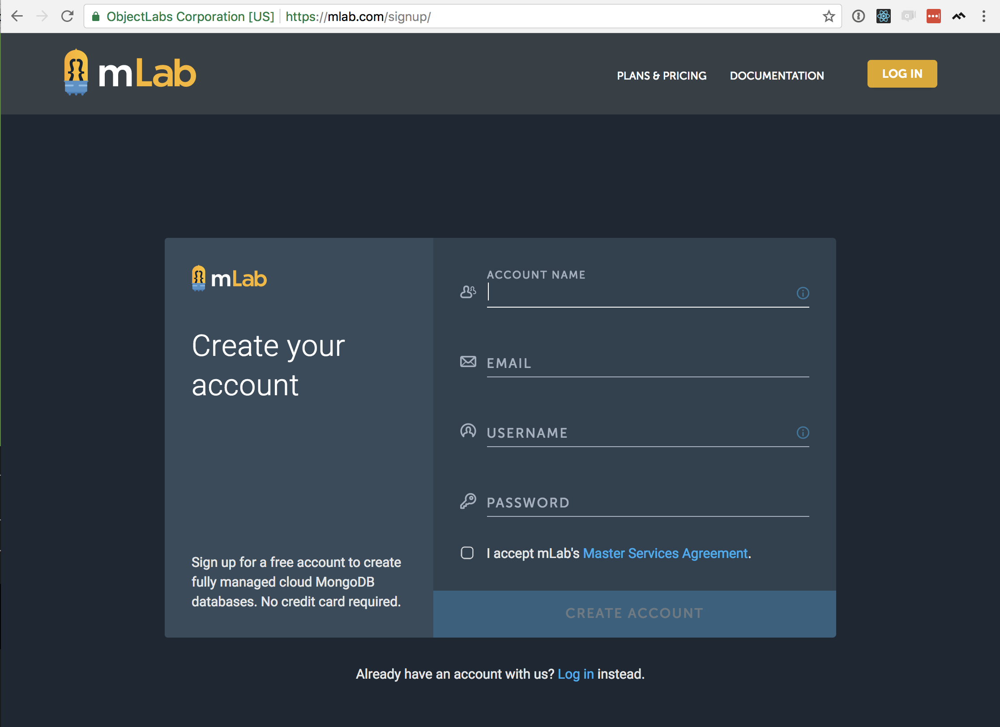
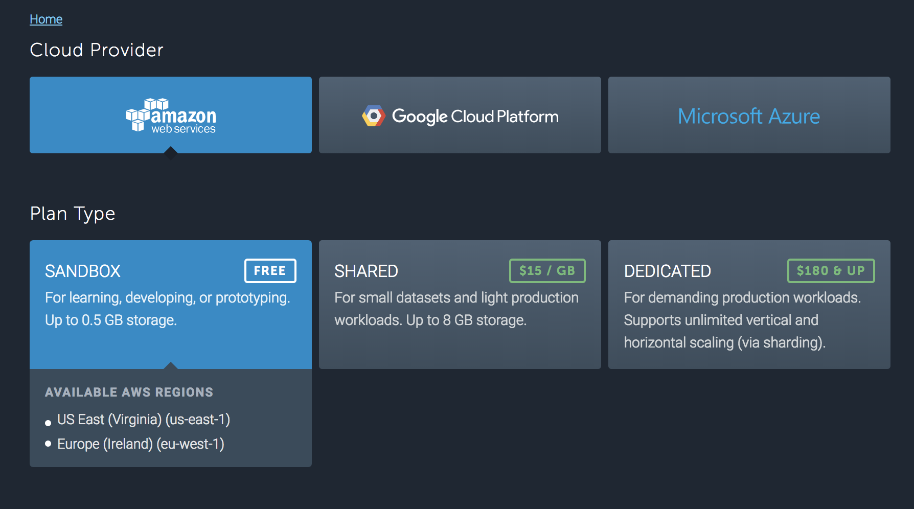
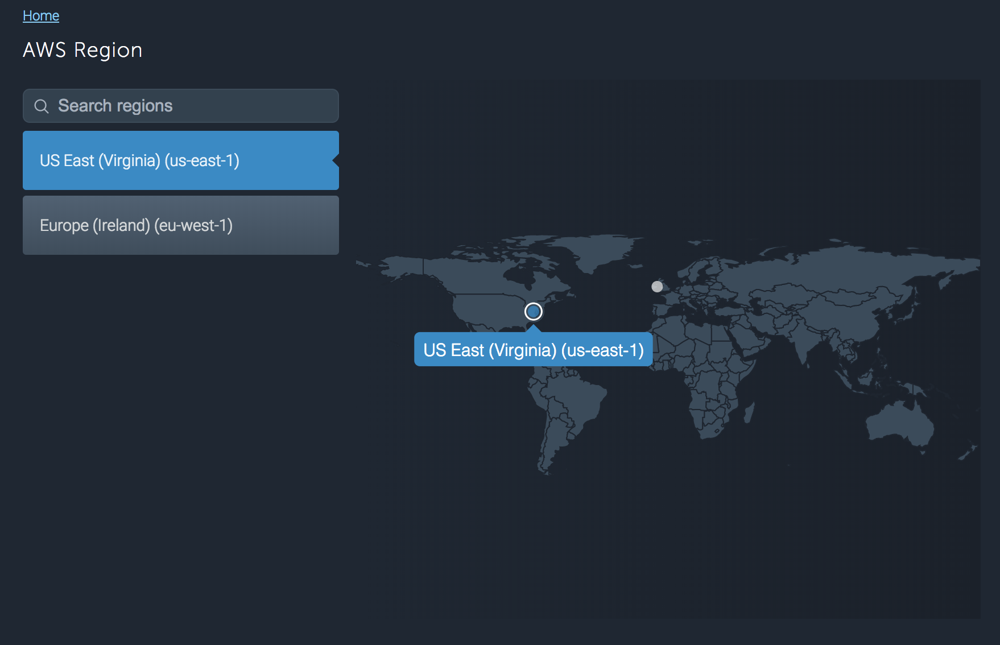
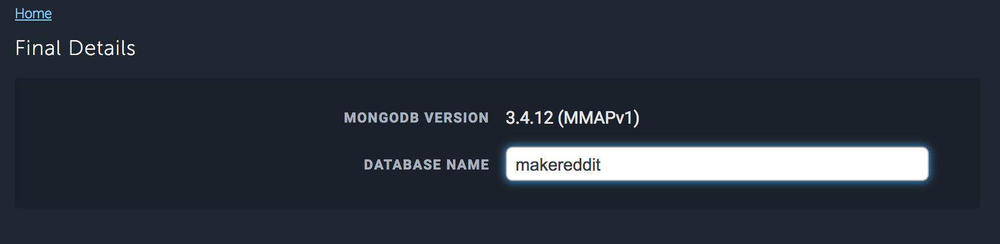
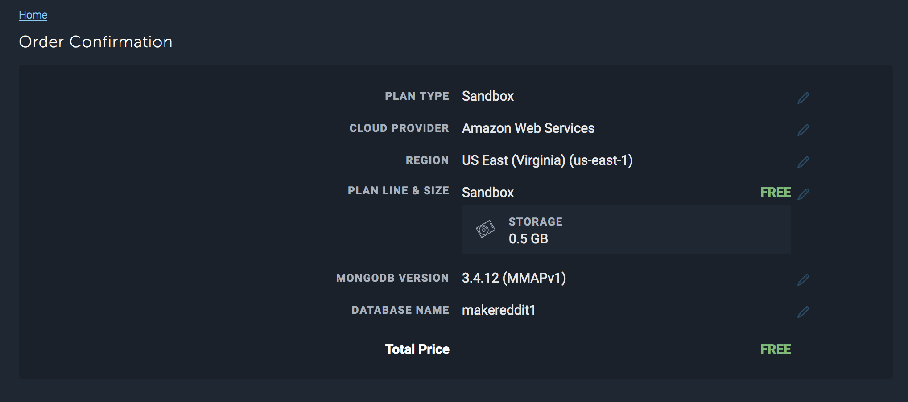
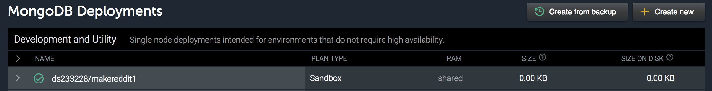
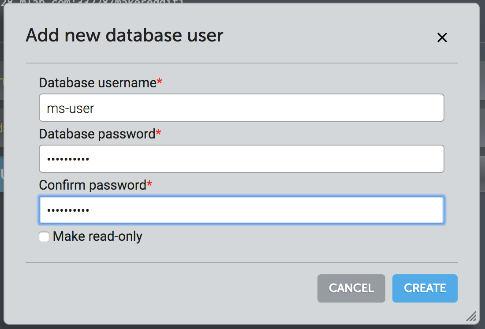
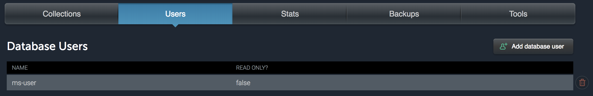

In this section, we'll finish setting up our dev environment by installing and configuring our database.  MongoDB is the database we'll be using, [mLab, Mongo Driver, Mongoose]

[TODO: Introduction to MongoDB]

# mLab

Rather than keeping our database on our local machines, we're going to use a DataBase-as-a-Service (DBaas) called mLab.  Storing our database on mLab's servers offers us two advantages:
- First, it greatly simplifies the setup process [...]
- Second, it gives us some handy tools for looking around inside our database [...]

In your browser, go to (https://mlab.com/signup/) to create an account.  (Unless you already have an account–in which case you can skip ahead)



[TODO: verify mLab account creation steps]

[After your account is created, click on `+ Create New` to create a new MongoDB deployment.]  Select 'Amazon Web Services' for your provider and 'Sandbox' for your plan type, as shown below, then click 'Continue'.



Choose the AWS region closest to you, and click 'Continue'.



Next, give your database a really cool name, like so:



And finally, complete the process by clicking 'Submit Order'.



We're almost finished setting up our database.  We just have one last step, which is to set up a username and password to keep nosy neighbors out of our database.  First, let's open that new database by clicking on its name in your MongoDB Deployments list.



Inside the database, you should see something like the screenshot below.  First, there are instructions for connecting to a MongoDB driver and a `mongodb://` URI.  We're not ready for this yet, but I wanted to point it out because we'll be back for it soon.  Down below, let's click on the 'Users' tab.  As expected, we don't have any database users yet, so let's click on '+ Add database user'.



Use whatever username and password you like.  I used username: ms-user, password: makeschool.  Click on 'Create'.  You should now see one user in your user table.



# MongoDB Driver and Mongoose

Now our database is all set up and ready to go on mLab's servers–but now we need to make our app connect to it.  We need to install two packages to help us do that.  The first–the MongoDB driver–lets us control a MongoDB database through a Node app. It will do its work mostly behind the scenes, though, because we're going to use [Mongoose](http://mongoosejs.com/) to work with our database.  Writing database code is not difficult (once you learn how), but it is boring, complicated and error-prone;  Mongoose makes things much simpler. [...]

## Installing the MongoDB Driver

[TODO: a step might be missing here.  QA on a computer that hasn't had mongodb installed before]

In your terminal, enter
```
npm install mongodb --save
```
(the `--save` tag adds the package to our `package.json` file so that will be included any time we run `npm install`)

## Connecting to Our mLab Database
