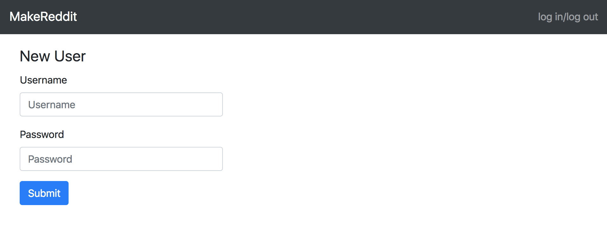
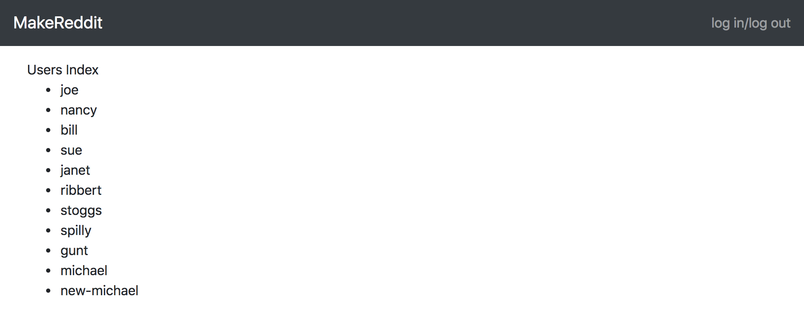
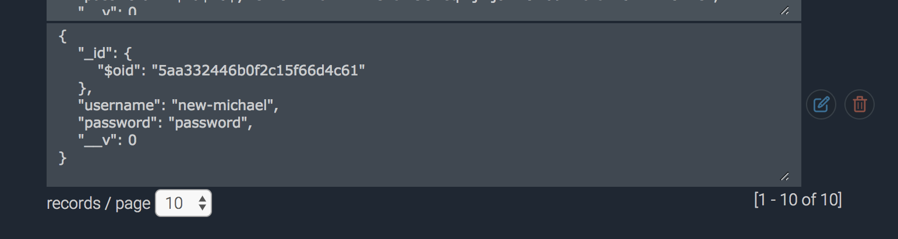
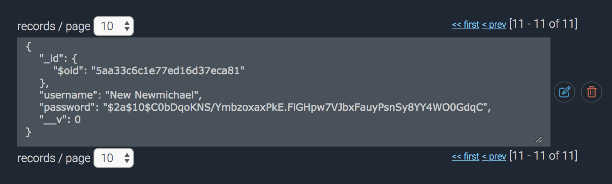
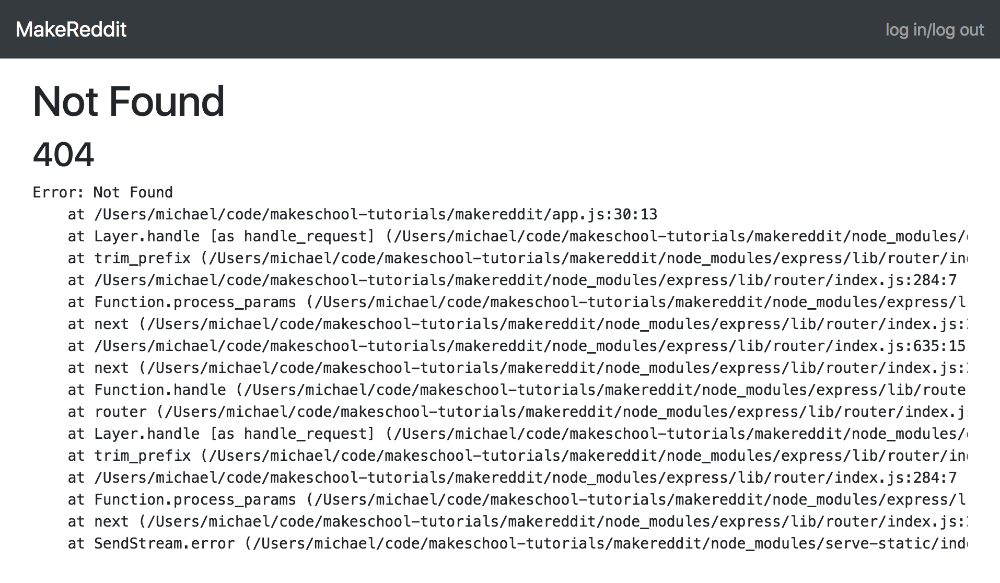
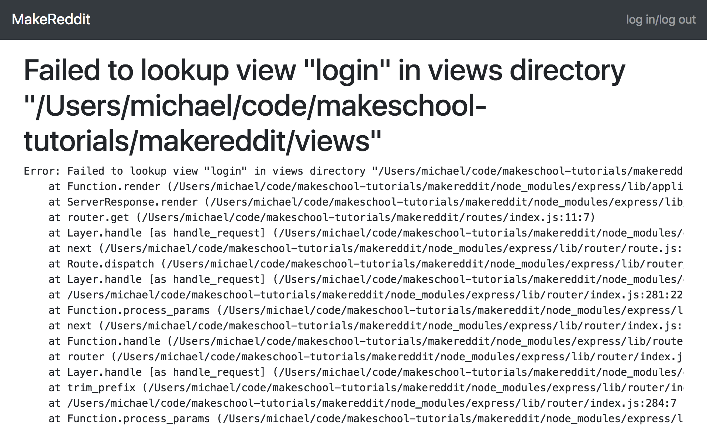
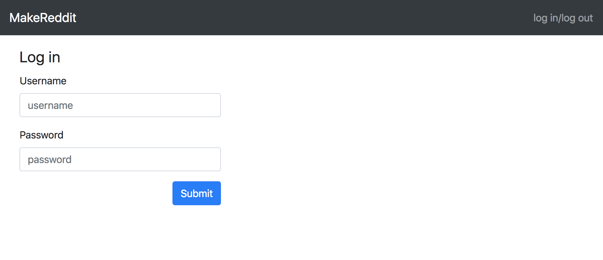
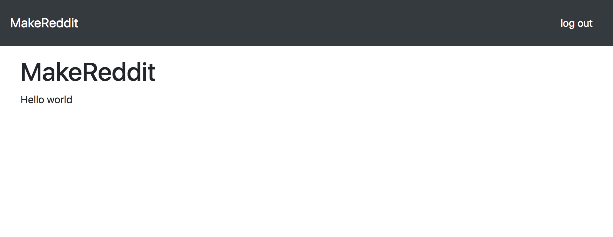

In this section, we will:

- Learn how password-based authentication systems work
- Require our users to create passwords with their accounts
- Securely store hashed passwords in the database
- Enable our users to log in and out

# Hashing Passwords

User registration and authentication are basic features needed by almost every web app, and there are lots of tools to help developers with the process. However, in this tutorial we're going to build our own _auth_ solution so that we can learn what goes on under the hood. Our solution is going to be really basic–just username, password, log in, log out–that's it.

> [info]
>
If you want to add more advanced features, like email verification, password reset, or google/facebook/twitter/etc. login, you can use a tool like [Passport](https://passportjs.com).

Even though we're building our system _mostly_ from scratch, we'll install a couple of tools to help us out.  [Bcrypt](https://www.npmjs.com/package/bcrypt) is a _cryptography_ package used to _hash_ users' passwords (we'll talk about _hashing_ below), and [express-session](https://github.com/expressjs/session), which will let us safely store a user's login and account information in a cookie on the user's browser.

> [info]
>
**MacOS / Unix / Linux:**
If you cannot install `bcrypt`, please uninstall it from your project. Next enter this command `npm install -g node-gyp` if you get an error because of access permissions, add `sudo` to the front of that command. Next install bcrypt again with the command `npm install --save bcrypt` It should now build from source and you should get a success message (ignore the warnings if you get some).
>
**Windows:**
If you cannot install `bcrypt`, please uninstall it from your project. You will need to download the community edition of Visual Studio before installing it again. Once installed (with build tools), you should be able to successfully run `npm install --save bcrypt`.

<!-- TODO: diagram how session cookies work -->
<!-- TODO: define cryptography, hashing, etc -->

Let's install these packages by entering the following command into your terminal:


> [action]
>
```
npm install bcrypt express-session --save
```

Now that the packages are all installed, let's set our app up to use them.  We'll start by giving our users passwords.

>[action]
>
Open the `models/user.js` file, and add `password: { type: String, required: true }` into the UserSchema. Your file should look like this:
>
```Javascript
const mongoose = require('mongoose');
const Schema = mongoose.Schema;
>
const UserSchema = new Schema({
  username: { type: String, required: true },
  password: { type: String, required: true }
});
>
const User = mongoose.model('User', UserSchema);
module.exports = User;
```
>
(Don't forget to add the comma (`,`) at the end of the `username` line!)

Now that our users can have a password (actually, _must_ have a password since we said `required: true`...), let's give them a way to set it up.

Open the `views/users/new.hbs`.  Notice that it contains a form with only one input, for a username.  

> [challenge]
>
Try to add a 'Password' input field yourself.

When you're done, compare your file with the solution below.

> [solution]
>
```HTML
<div>
  <form action="/users" method="post">
    <legend>New User</legend>
>
    <div class="form-group">
      <label for="user-username">Username</label>
      <input type="text" name="username" class="form-control" id="user-username" placeholder="Username">
    </div>
>
    <!-- New code below: -->
    <div class="form-group">
      <label for="user-password">Password</label>
      <input type="password" name="password" class="form-control" id="user-password" placeholder="Password">
    </div>
>
    <div class="text-right">
      <button type="submit" class="btn btn-primary">Submit</button>
    </div>
  </form>
</div>
```
>
Pay special attention to the input type of that password field, `<input type="password"` – not `text`. This will give our password field some useful properties, like hiding the characters a user •••••s.

Let's try it out!  Go to `localhost:3000/users/new`, and now you should see a form with a username and a password field.



Enter any username and password you like, click 'Submit', and our new user should appear on our user index page.



That looks good.  Let's check out the new user on mLab to see what it looks like in the database. Go to [mlab.com](https://mlab.com/home), click on your `makereddit` database, click on `Users` to see the documents, and find your new user in the list:



Great, our users have passwords now! If you look in the database you can see that my new password is 'password' – and that's not so great.  Of course 'password' is a really, really insecure password, but we have an even bigger problem–everyone can see my password! Here's one of the most important rules of basic web security: **NEVER STORE PLAIN TEXT PASSWORDS**. It's a bad idea.  Databases are not especially secure, and storing plain-text passwords there makes them very easy to steal.

The trick to avoid storing plain-text passwords is a technique called _hashing_. That's why we installed _Bcrypt_. Bcrypt is like a black box where we can put in a regular plain-text password, and take out a _hash_ – a version of our password that has been irreversibly scrambled. This way, we never know the user's password.

Later, when we implement logging in, the user will enter their password into the log in form and send it to our log in route. Then we'll hash whatever password the user enters, and compare that to the hashed password in our database. However, it would be almost impossible for us to guess what password produced the hash.

<!-- TODO: this could be explained so much better, and a diagram would be useful -->
<!-- TODO: a given password will always produce the same hash, no two passwords will ever produce the same hash (very unlikely), hashing cannot be reversed -->

> [action]
>
Let's open our user model at `models/user.js`.  Require bcrypt at the top of the file (use `const bcrypt = require('bcrypt')`), then add the following in, after you define the UserSchema:
>
```Javascript
UserSchema.pre('save', function(next) {
  let user = this;
>
  bcrypt.hash(user.password, 10, function (err, hash){
    if (err) return next(err);
>
    user.password = hash;
    next();
  })
});
```

This code comes from the [Bcrypt documentation page](https://github.com/kelektiv/node.bcrypt.js). First, we call the `.pre()` method on `UserSchema`, which takes a callback. It fires _before_ (pre-) the action you pass as the first argument (in this case, `save`). So here we're saying, "before we 'save', call this function." If we wanted the function to happen _after_ we save, we could call `.post()`.

Before we save a user to the database, we call Bcrypt's `.hash()` method, which gives us the hash of the user's password. We then save the _hash_ to the database – _not the password_.

>[info]
>
`next()` is a callback that will be supplied by the system later. It's a very common feature in Express apps and part of a feature called [middleware](https://expressjs.com/en/guide/using-middleware.html). You don't need to know all about it right now; you'll get used to seeing it.

<!--  -->

>[solution]
>
When you're done, `models/user.js` should look exactly as it does below.
>
```Javascript
const mongoose = require('mongoose');
const Schema = mongoose.Schema;
const bcrypt = require('bcrypt');
>
const UserSchema = new Schema({
  username: { type: String, required: true },
  password: { type: String, required: true }
});
>
UserSchema.pre('save', function(next) {
  let user = this;
>
  bcrypt.hash(user.password, 10, function (err, hash){
    if (err) return next(err);
>
    user.password = hash;
    next();
  })
});
>
const User = mongoose.model('User', UserSchema);
module.exports = User;
```

Let's make sure this works as expected. Go back to `localhost:3000/users/new` and make another new user. Then, go over to mLab and check the new user in the database–pay special attention to the password, because it should look like a long string of random characters. This is our _hashed_ password.



Now that our users have passwords, and we're saving them so securely that even we can never know what they are, let's give them the ability to log in.

# Set up Log in Route

Let's start with the URL–where should our users go to log in? The usual way is to have our users go to `/login`. If we try that right now–in your browser, visit `localhost:3000/login`–what happens?



[It doesn't work, that's what happens](https://developer.mozilla.org/en-US/docs/Web/HTTP/Status).  We never defined that endpoint–which is to say, we never told our app what to do if someone visits that address.

Let's open the `routes/index.js` file. Users get their own routes file in `routes/users.js`, and other resources will get their own files, too.  But login and logout are kind of special (along with the root (`/`)) so we'll keep them right in `index.js`. Let's add a login route.

>[action]
>
Add a login route to `routes/index.js`:
>
```Javascript
// login
router.get('/login', (req, res, next) => {
  res.render('login');
});
```
>
Here we're telling our _controller_ (or _router_, as it's called in Express) what to do when we receive a GET request to `http://your-site.com/login`. When that happens, our app will fire the callback we provide, which takes three arguments: `req`, `res`, and `next`. We've seen `next` before–that's a callback function that will be provided by Express, and we usually don't need to think about it too much. `req` and `res` represent the HTTP request and HTTP response–basically, `req` is whatever the browser sends to the server, and `res` is whatever the server sends back to the browser.

Now let's visit `localhost:3000/login` again.  It still doesn't work, but what's wrong now?



In our `/login` route, we told our app to render a file called `'login'`. So it looks in the `/views` directory expecting a file called "login", just like we told it to, but that file isn't there. Let's create it:

>[action]
>
Create a new file `views/login.hbs`, and add the following form inside:
>
```HTML
<form action="/login" method="post">
  <legend>Log in</legend>
>
  <div class="form-group">
    <label for="user-username">Username</label>
    <input type="text" name="username" class="form-control" id="user-username" placeholder="username">
  </div>
>
  <div class="form-group">
    <label for="user-password">Password</label>
    <input type="password" name="password" class="form-control" id="user-password" placeholder="password">
  </div>
>
  <div class="text-right">
    <button type="submit" class="btn btn-primary">Submit</button>
  </div>
</form>
```

Now when we visit `localhost:3000/login`, we see our login form.



But if we try to log in now, what do you expect to happen? It won't work yet. When we submit a form, where does it send that data? (Hint: check the form's `action`)

<!-- TODO: review HTTP verbs -->

>[action]
>
Open `routes/index.js`.  We need to define a POST route to `/login`, so include the following snippet:
>
```Javascript
router.post('/login', (req, res, next) => {
  console.log('logging in!');
  console.log(req.body);
>
  res.redirect('/');
});
```
>
This tells our app what to do if it ever it receives a POST request to `http://your-site.com/login`. It's the same URL as above, but our app will behave differently depending on whether it receives a GET or a POST request. We're not doing anything yet, except printing some information to the console. But with all of our groundwork laid, we're ready to authenticate users.

# Authentication

But how does logging in actually work?  It's gotta be crazy complicated, right?  Some parts are, actually.  We're going to use something called the Blowfish Cypher (hence: `bcrypt`).  You can read all about it in [this Wikipedia article](https://en.wikipedia.org/wiki/Blowfish_(cipher))–but, it may be best not to go too far down that rabbit hole right now. The hard parts have already been done for us, and we have a convenient package that's easy to use. And the basic principles behind secure logins aren't difficult to understand.

When our users visit `/login`, they see a login form.  They enter their username and password, and submit the form. Finally, there's a two-step authentication process–first, we search the database for a user with the given username and-if they exist–we check if their password is correct.

The tricky part is that we don't know what the user's password is supposed to be. (Because we NEVER EVER STORE PLAIN TEXT PASSWORDS IN OUR DATABASE). But we do have the _hashed_ form of their password, so if we hash the password they just entered we can see if it matches the hashed password in our database.  

<!-- TODO: a diagram would be useful -->
<!-- TODO: infobox on salting -->

>[action]
>
Let's open `models/user.js` to add an `.authenticate()` method to our users, so that the entire file looks like this:
>
```Javascript
const mongoose = require('mongoose');
const Schema = mongoose.Schema;
const bcrypt = require('bcrypt');
>
const UserSchema = new Schema({
  username: { type: String, required: true },
  password: { type: String, required: true }
});
>
UserSchema.pre('save', function(next) {
  let user = this;
>
  bcrypt.hash(user.password, 10, function (err, hash){
    if (err) return next(err);
>
    user.password = hash;
    next();
  })
});
>
UserSchema.statics.authenticate = function(username, password, next) {
  User.findOne({ username: username })
    .exec(function (err, user) {
      if (err) {
        return next(err)
      } else if (!user) {
        var err = new Error('User not found.');
        err.status = 401;
        return next(err);
      }
      bcrypt.compare(password, user.password, function (err, result) {
        if (result === true) {
          return next(null, user);
        } else {
          return next();
        }
      });
    });
}
>
const User = mongoose.model('User', UserSchema);
module.exports = User;
```

<!-- TODO: briefly talk through code,  will define `next` in section below  -->

Now let's take a step back and look at the big picture–we have a method  `User.authenticate('myusername', 'secretpassword')`  to log our user in, but how/when/where do we do that?  We want to call `authenticate()` when users send us their password, which happens when they submit the login form. Check the HTML form in `views/login.hbs`–where does it go when we submit?

```HTML
<form action="/login" method="post">
  ...
```

This tells the form to send a POST request to `/login`, which we define in `routes/index.js`–let's open that file.  

>[action]
Before we update our request to `/login` we need to make sure to add our `User` class, otherwise the `.authenticate()` function will not work.
>
```Javascript
const express = require('express');
const router = express.Router();
const User = require('../models/user');
>
/* our index routes */
```
>
Let's define a POST request to `/login` like this:
>
```Javascript
// POST login
router.post('/login', (req, res, next) => {
  User.authenticate(req.body.username, req.body.password, (err, user) => {
    if (err || !user) {
      const next_error = new Error("Username or password incorrect");
      next_error.status = 401;
>
      return next(next_error);
    } else {
      req.session.userId = user._id;
>
      return res.redirect('/') ;
    }
  });
});
```
>
Inside `.post('/login', ...)`, the first thing we do is call the `.authenticate()` method, passing in the login form data and a callback (`req` represents the HTTP request object, and form data lives in the `body` of those requests). The callback (`(err, user) => {...}`) becomes the `next()` function in `UserSchema.statics.authenticate`, defined in `models/user.js`.

<!-- TODO: talk through UserSchema.statics.authenticate code here -->

In the end, your complete `/routes/index.js` file should look like this:

```Javascript
const express = require('express');
const router = express.Router();
const User = require('../models/user');

// home page
router.get('/', (req, res, next) => {
  res.render('index', { title: 'MakeReddit' });
});

// login
router.get('/login', (req, res, next) => {
  res.render('login');
});

// POST login
router.post('/login', (req, res, next) => {
  User.authenticate(req.body.username, req.body.password, (err, user) => {
    if (err || !user) {
      const next_error = new Error("Username or password incorrect");
      next_error.status = 401;

      return next(next_error);
    } else {
      req.session.userId = user._id;

      return res.redirect('/') ;
    }
  });
});

module.exports = router;
```

There's just one final detail before our user can log in–we need to set our app up to use _session cookies_. We installed the `express-sessions` way up at the top of this page, but we never configured Express to use them.

>[action]
>
We configure Express in `app.js`, so open that file and add the following before we setup our routes. The ordering of this is very important. Because this is a middleware function, it needs to be setup before we configure out routes, otherwise the routes won't have access to the middleware (meaning our sessions will not work at all).
>
```Javascript
// configure sessions
const session = require('express-session');
app.use(session({ secret: 'secret-unique-code', cookie: { maxAge: 3600000 }, resave: true, saveUninitialized: true }));
```
>
(This code comes from the [Express Session documentation](https://github.com/expressjs/session)).

<!-- TODO: info box for session cookies -->

Now, let's go to `localhost:3000/login` in your browser, enter your username and password, click submit, and... well, hopefully there's no error message, but it's hard to know what, if anything, happened under the hood. Let's make our app show us whether we're logged in or not.

# Toggle "Log in"/"Log out" Link

In your browser, notice the 'log in/log out' text on the right side of the header.  Obviously, this isn't how log in buttons are supposed to work–it isn't even a real link.  Let's add some logic that checks if a user is logged in–and if they're not, we'll offer them a 'log in' link; if they are, the link will say 'log out'.

>[action]
>
The header is defined in our layout file.  Open `views/layout.hbs`, and replace the `<nav>` section with the following code:
>
```HTML
<nav class="navbar navbar-dark bg-dark">
  <div class="navbar-brand">
    MakeReddit
  </div>
>
  <div class="navbar-text">
    {{# if currentUserId}}
      <a class="nav-link" href="/logout">log out</a>
    {{else}}
      <a class="nav-link" href="/login">log in</a>
    {{/if}}
  </div>
</nav>
```
>
This code has some new syntax, the `{{# if ...}} {{else}} {{/if}}` statement in Handlebars. This is one of several built-in [Handlebars helpers](http://handlebarsjs.com/block_helpers.html); we saw `{{#each}}` in an earlier section.

However, this doesn't work yet.  Try it if you like–go to `localhost:3000/login`, enter your username and password... and still be offered a link to log _in_.  Take another look at that `{{# if}}` statement. Can you spot the problem?  We never assign any value to `currentUserId`, so it's not possible to avoid the `{{else}}` branch; `currentUserId` will always be `undefined`.

>[action]
>
We need to define the variables for this view in the controller (or in this case, our routes file) at `routes/index.js`.   
>
Let's modify the GET request for our root route to check the session for a `userId` and pass that value–if it exists–to our view. Replace the existing `router.get('/', ...)` function with the code below:
>
```Javascript
// home page
router.get('/', (req, res, next) => {
  const currentUserId = req.session.userId;
>
  res.render('index', { title: 'MakeReddit', currentUserId: currentUserId });
});
```

And now let's try logging in.  Assuming you remembered your password correctly, you should be back at the home page and in the upper right-hand corner it _should_ say "Log out". Nice! But we're not quite finished yet...

Go back to `localhost:3000/login`, and what happens to our "Log in/Log out" link? It's back to "Log in"–which means that either we're not logged in anymore (we are), or that our layout forgot.  If you look back at `routes/index.js`, you might notice that when we call `res.render` in our `router.get('login', ...)` function, we don't pass any values for  `title` or `currentUser`.  This means that when we go to `/login`, the view (Handlebars) doesn't know what `currentUser` is, so it renders a "Log in" link.  (You might have noticed that the title is missing, too).

<!-- TODO: Add infobox for middleware, point out how often we've used the pattern -->

>[action]
>
We can write a simple _middleware_ function to assign values to `title` and `currentUserId` before every router action by adding the following code to `routers/index.js` before we define any of our routes:
>
```Javascript
// set layout variables
router.use(function(req, res, next) {
  res.locals.title = "MakeReddit";
  res.locals.currentUserId = req.session.userId;
>
  next();
});
```
>
While we have `routers/index.js` open, let's also remove the references to currentUserId we added to `router.get('/', ...)`, so that the whole file looks like this:
>
```Javascript
const express = require('express');
const router = express.Router();
const User = require('../models/user');
>
// set layout variables
router.use(function(req, res, next) {
  res.locals.title = "MakeReddit";
  res.locals.currentUserId = req.session.userId;
>
  next();
});
>
// home page
router.get('/', (req, res, next) => {
  res.render('index');
});
>
// login
router.get('/login', (req, res, next) => {
  res.render('login');
});
>
// POST login
router.post('/login', (req, res, next) => {
  User.authenticate(req.body.username, req.body.password, (err, user) => {
    if (err || !user) {
      const next_error = new Error("Username or password incorrect");
      next_error.status = 401;
>
      return next(next_error);
    } else {
      req.session.userId = user._id;
>
      return res.redirect('/') ;
    }
  });
});
>
module.exports = router;
```

And if we go back to `localhost:3000/login` and submit our username and password, we should see a 'log out' link in the upper-right corner.



# Logout

As far as our app is concerned, the user is logged in if they send a correctly formatted session cookie with their request. So to log them out, we need to destroy that cookie.

>[action]
>
Open `routes/index.js` and add an action for logout:
>
```Javascript
// {  ...existing code... }
>
// logout
router.get('/logout', (req, res, next) => {
  if (req.session) {
    req.session.destroy((err) => {
      if (err) return next(err);
    });
  }
>
  return res.redirect('/login');
});
>
module.exports = router;
```
>
This code checks whether the request has a session cookie attached and, if so, deletes it. It then redirects the user to the login page. If there is no session, we also just want to redirect the user to the login page.

# Authorization

And now we come to _authorization_. All the steps in this section up to this point have been about _authentication_, or making our users prove who they are. After they're authenticated, we want to _authorize_ (or _allow_) them to view certain pages.

Our authorization strategy will be another piece of _middleware_ that will allow users to access pages if they are logged in, and redirect them to the login page if they are not.  Remember that to the system, being "logged in" just means that your browser has a _session cookie_ with your user id in it.  To check if someone is logged in, we only need to check for the existence of that value.

>[action]
>
Let's create a new file, and a new folder, called `routes/helpers/auth.js` and add the following code inside:
>
```Javascript
exports.requireLogin = (req, res, next) => {
  if(req.session && req.session.userId) {
    return next();
  } else {
    let err = new Error('You must log in to view this page');
    err.status = 401;
>
    return res.redirect('/login');
  }
}
```
>
This function might look complicated at first, but it is really simple. It just checks for the existence of a `session`, and a `userId` value on that session. If they both exist, we call `next()` and continue on; otherwise we redirect the user to the login page.

Let's see an example of how to use this code by requiring authorization for users to view our users index–the list of all the users in the system.  To start, open the users routes file (`routes/users.js`) and include our authorization helpers at the top (`const auth = require('./helpers/auth')`).

We usually define routes in Express like this:

```Javascript
// login
router.get('/login', (req, res, next) => {...})
```

Here, the `.get()` method takes two arguments–the path it will respond to and a callback that accepts the `req`, `res` and `next` arguments. Any time we want to use _middleware_, though, Express will let us pass a middleware function as the second argument. In other words, to require authorization, we only need to pass `auth.requireLogin` as the second argument.

>[action]
>
In `routes/users.js`, add `auth.requireLogin` to the Users index action, so that the whole file looks like this:
>
```Javascript
const express = require('express');
const router = express.Router();
const User = require('../models/user');
const auth = require('./helpers/auth')
>
//Users index
router.get('/', auth.requireLogin, (req, res, next) => {
  User.find({}, 'username', function(err, users) {
    if(err) {
      console.error(err);
    } else {
      res.render('users/index', { users: users });
    }
  });
});
>
// Users new
router.get('/new', (req, res, next) => {
  res.render('users/new');
})
>
// Users create
router.post('/', (req, res, next) => {
  const user = new User(req.body);
>
  user.save(function(err, user) {
    if(err) console.log(err);
    return res.redirect('/users');
  });
})
>
module.exports = router;
```

Let's make sure everything here works: be sure that you're logged out of the app (you should see a "Log in" link in the upper right) and try to visit `localhost:3000/users`.  If you're redirected to `localhost:3000/login`, we're ready to move on.

# Summary

In this section, we required users to have passwords to log in to our sites. We also learned how to hash those passwords in order to safely store them in our database. We implemented logging in and out, and finally we required authorization to view secure web pages.

In the next section we'll create rooms for our users to have discussions in.
