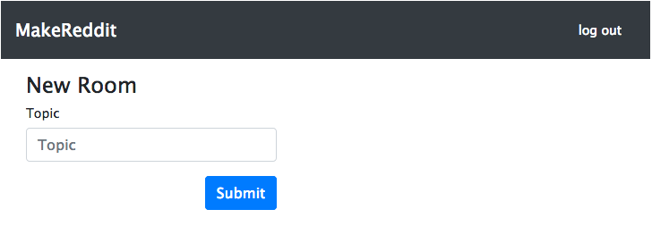
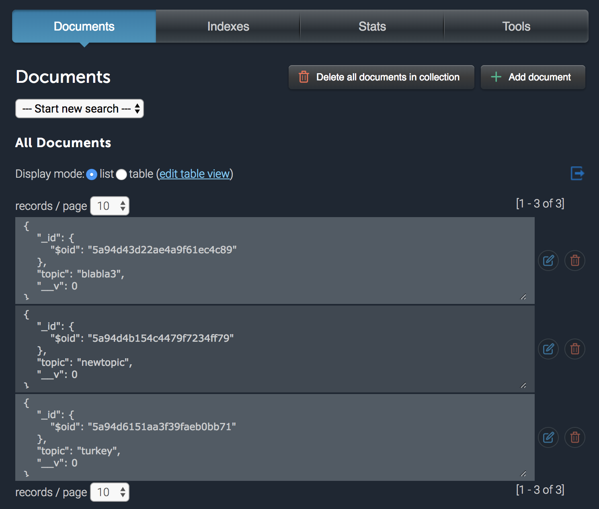
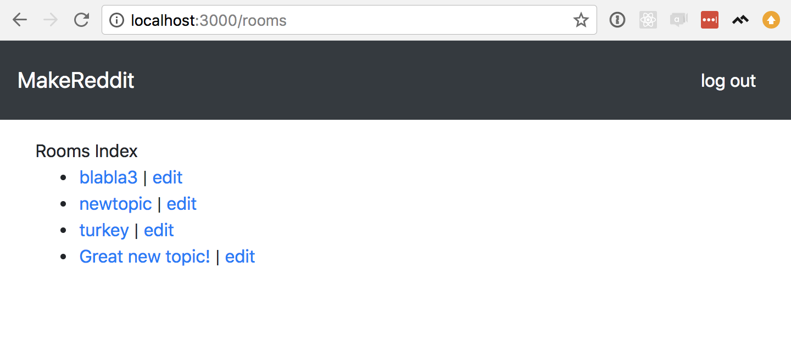

In this section we will create "rooms" for our users to have discussions in.  Along the way, we'll learn more about how web apps rely on HTTP to communicate over the internet and how to follow REST conventions so that other developers will be able to predictably work with our app.

<!-- TODO: In the next section we'll implement all of these actions–after we introduce CRUD concepts–but in this section we'll just -->

# HTTP and REST

<!-- ## HTTP -->
<!-- HTTP is the language of the internet. TODO: copy whatever Chase wrote in htiw -->

## REST

Our web app is made of web pages, and each of those web pages has a URL. As your apps become more complicated and generate more pages, you're going to have to manage an increasing number of those URLs, and it becomes very important to have some system to manage them all.

REST is a system that calls for organizing our URLs by _resource_. Each _resource_ can have seven basic actions, as in the following chart:

<!-- TODO: REST chart -->

These seven actions should cover most situations you'll come across in a web app. Often, you won't need all of the actions, just one or two–that's totally OK. Occasionally, you'll need an _extra_ action–it's better to avoid that if possible, but sometimes you can't avoid it, and that's OK too. The nice thing about REST is that it's just a convention–if you do things differently it will still _work_, but if you stick closely to the convention, you'll have to make fewer decisions, and other developers will be able to more easily work with your code.

There are a few confusing points about REST. First, notice that some behavior requires _two_ actions. `new` and `create`, for example, are both needed to create a new object–the `create` action is a `POST` request that receives data from the user to store in the database, while the 'new' action is a `GET` request sends the user a web form to collect that information. `edit` and `update` have a similar relationship.

<!-- TODO: new/create workflow -->

Another tricky aspect is that some of these actions use the same URL–in the example table above, `index` and `create` both point to `/items`; `show`, `update` and `destroy` all point to `/items/:id`. The difference is the HTTP _verbs_, `GET`, `POST`, `PUT` (or `PATCH`, both are OK) and `DELETE`. In REST, it's really important to send the proper HTTP verb.

There's one last issue that also relates to the HTTP methods–the only HTTP methods available to us in HTML are `GET` and `POST`. The other HTTP methods (here, `PUT`, `PATCH` and `DELETE`) require more advanced frameworks than we're using here, so we'll make a few adjustments to accommodate that.

# Room Models

<!-- TODO: creating an ERD or some diagram of the completed models so that I can reference it throughout section. -->

Let's start by defining what a "room" is supposed to look like when we store it in our database. We're going to begin really simple and create rooms that will each have a single attribute, a `topic`. Each room will also have many posts about that topic as people start conversations, but we'll deal with that in the next part of this tutorial. For now, create a file for our room model called `models/room.js` and paste the following code into it:

```Javascript
const mongoose = require('mongoose');
const Schema = mongoose.Schema;

const RoomSchema = new Schema({
  topic: { type: String, required: true },
});

module.exports = mongoose.model('Room', RoomSchema);
```

This is very similar to the User model we set up in Part 1, so please review that if any of this code seems mysterious. Before we can check whether this works the way we expect, we need a way to add rooms to our database.  Let's set up _new_ and _create_ actions for our Rooms to do just that.

<!-- TODO: here reference REST diagram that doesn't exist yet -->

# Rooms New and Create

Following the REST convention, we expect to go to `rooms/new` to find the form to create a new room, and then POST a form to `rooms/` to add it to our database. Let's create a new file to hold our room routes called `routes/rooms.js`, and paste in the following:

<!-- TODO: edit to reference REST diagram -->

```Javascript
const express = require('express');
const router = express.Router();

const auth = require('./helpers/auth');
const Room = require('../models/room');

// Rooms index
router.get('/', (req, res, next) => {
  // TODO
});

// Rooms new
router.get('/new', auth.requireLogin, (req, res, next) => {
  // TODO
});

// Rooms show
router.get('/:id', auth.requireLogin, (req, res, next) => {
  // TODO
});

// Rooms edit
router.get('/:id/edit', auth.requireLogin, (req, res, next) => {
  // TODO
});

// Rooms update
router.post('/:id', auth.requireLogin, (req, res, next) => {
  // TODO
});

// Rooms create
router.post('/', auth.requireLogin, (req, res, next) => {
  // TODO
});

module.exports = router;
```

Here we have six of the seven REST actions defined–we will leave the _delete_ action off for now–and we'll fill them all in over the next few sections.

Notice that we are requiring _authorization_ for every route except the index. Any user may see what topics are being discussed, but they'll need to register and log in to read the conversations.

## New

The single purpose of our `new` action is to show users the form they need to make a new room, so we need to create a view with a form on it, then configure our _controller_ in `routes/rooms.js` to return that view.

Create a file (in a new `views/rooms` folder) called `views/rooms/new.hbs` and paste in the following code, which will render a web form for creating a new room:

```HTML
<div>
  <form action="/rooms" method="post">
    <legend>New Room</legend>
    <div class="form-group">
      <label for="room-title">Topic</label>
      <input type="text" name="topic" class="form-control" id="room-topic" placeholder="Topic">
    </div>

    <div>
      <button type="submit" class="btn btn-primary">Submit</button>
    </div>
  </form>
</div>
```

And in `routes/rooms.js`, replace `router.get('/new', (req, res, next) => { ... });` with:

```Javascript
// Rooms new
router.get('/new', auth.requireLogin, (req, res, next) => {
  res.render('rooms/new');
});
```

And one last detail to tie it all together–notice that we're defining our action on `'/new'`. We want to make our URL be `makereddit.com/rooms/new` to be RESTful, not `makereddit.com/new`. So inside our `app.js` file, let's add the following:

```Javascript
const rooms = require('./routes/rooms');

// ...

app.use('/rooms', rooms);
```

This tells our index router to _namespace_ all of the routes we define in `routes/rooms.js` under `rooms/`.

Visit `localhost:3000/rooms/new` (be sure you're logged in!), and you should see this:



## Create

Now, recall that our `create` action listens for a POST request to `/rooms`, then uses the data from that request to store a new Room object in the database. So let's look at `routes/rooms.js`, and replace `.post('/', ...)` with:

```Javascript
// Rooms create
router.post('/', auth.requireLogin, (req, res, next) => {
  let room = new Room(req.body);

  room.save(function(err, room) {
    if(err) { console.error(err) };

    return res.redirect('/rooms');
  });
});
```
<!-- TODO: talk through code -->

Now when you submit a new form on `rooms/new`, you won't get anything back because we haven't implemented our `index` action yet (that's next). If we check out our database on `mlab.com`, however, we can see that rooms are being saved in our database.



<!-- TODO: add file tree -->

# Rooms Index

Our Rooms _index_ action will show users a page that lists all of the rooms in our database.  Notice that our `create` action above redirects users to the rooms index (`/rooms`).

Let's set up the view at `views/rooms/index.hbs`. Create that file and paste the following inside:

```HTML
<div>
  Rooms Index
</div>

<div>
  <ul>
    {{#each rooms as |room|}}
      <li>
        <a href="rooms/{{room.id}}">{{room.topic}}</a> | <a href="rooms/{{room.id}}/edit">edit</a>
      </li>
    {{/each}}
  </ul>
<div>
```

(Notice that I included an `edit` link for each of the rooms. They won't work until we implement our _edit_ and _update_ actions, which we'll do a little further down the page.)

Now we need to set up our `index` controller action in `routes/rooms.js`. Replace the existing `Rooms index` action with:

```Javascript
// Rooms index
router.get('/', (req, res, next) => {
  Room.find({}, 'topic', function(err, rooms) {
    if(err) {
      console.error(err);
    } else {
      res.render('rooms/index', { rooms: rooms });
    }
  });
});
```

This is similar to our home page action in `routes/index.js`, but with one big difference–all of our logic happens inside a _callback function_ that we pass to `Room.find()`. `Room.find` is the method we use when we want to find a particular document or documents that match some criteria. For example, if we want to find the room with a 'sports' topic (if it exists), we would call `Room.find({ 'topic': 'sports' }, 'topic', function(err, rooms) {...})`. Passing an empty object (`{}`) for the first argument will return all of the documents for that model.

For detailed information on how Mongoose queries work, check out [their documentation](http://mongoosejs.com/docs/queries.html).

<!-- TODO: info box about arrow functions and mongodb -->

In the end, we should be able to visit `localhost:3000/rooms/new`, save a new room, and then see something like this:



# Rooms Show

Where an `index` shows a collection of items, such as all the rooms in our database, the `show` action lets us look at a single object.  At first our rooms' _show_ views won't be very interesting–we'll fill it with posts in the next part of this tutorial–but all of the links on our `index` view are broken right now, and we can at least fix that.

Create a new file for our view at `views/rooms/show.hbs` and paste in the following:

```HTML
<div>
  <h2>{{room.topic}}</h2>
</div>

<div>
  Coming soon: posts!
</div>
```

Then, in our controller we need to render this file when anybody visits `/rooms/:id` (where `:id` is the id of a specific room) and set the value of `room` on the second line.  In `routes/rooms.js`, replace `get('/:id', ...)` with:

```Javascript
// Rooms show
router.get('/:id', auth.requireLogin, (req, res, next) => {
  Room.findById(req.params.id, function(err, room) {
    if(err) { console.error(err) };

    res.render('rooms/show', { room: room });
  });
});
```

This code is really similar to the Rooms _index_ action we added above. The key difference is that instead of calling `Room.find()` to get multiple Room documents, we call `Room.findById()` to get back a specific room, that we already have the ID for.

<!-- TODO: infobox to explain slugs and route order (keep slugs after named routes) -->
<!-- TODO: infobox on `req.body` and `req.params` (or add to section where req.body first appears) -->

Now if you visit `localhost:3000/rooms` and click on a Room topic (not the edit links–those are still broken), you should see that Room's _show_ view.


# Rooms Edit and Update

<!-- TODO: point out how new/create mirrors edit/update, give a few code snippets, ask students to try implementing, and hide final code behind a solution fold.  Esp., point out that we need the room id in the form action, so we need to pass that in from the controller -->

The Rooms _edit_ and _update_ actions work together the same way that the _new_ and _create_ actions do. The _edit_ action (a GET request to `/rooms/:id/edit`) returns a form for users to enter new information, and the _update_ action (a POST request to `/rooms/:id`) saves the updated information to the database.
<!-- TODO: create REST diagram and reference here -->

## Rooms edit

First, you're going to need to create a file for your view at `views/rooms/edit.hbs`. This file will be similar to `views/rooms/new.hbs`, but you'll need to change the form's `action` from `action="/rooms"` to `action="/rooms/{{room.id}}"`, and update the `input` field to `<input type="text" name="topic" class="form-control" id="room-topic" value="{{room.topic}}">`.

Notice that both of these snippets reference a `room` variable–this is just like our `views/rooms/show.hbs` file. There, we had to pass a `room` from our Rooms _controller_'s _show_ action to the view, and here we'll pass one from the _edit_ action. In the Rooms controller_show_ action, we find the Room document by using `Room.findById()`–you'll need to do the same thing here. And just like in the _show_ action, you can get the Room's ID from `req.params.id`.

<!-- TODO: hide solutions behind fold -->

`views/rooms/edit.hbs`:
```HTML
<div>
  <form action="/rooms/{{room.id}}" method="post">
    <legend>Edit Room</legend>
    <div class="form-group">
      <label for="post-topic">Topic</label>
      <input type="text" name="topic" class="form-control" id="room-topic" value="{{room.topic}}">
    </div>
    <div class='text-right'>
      <button type="submit" class="btn btn-primary">Submit</button>
    </div>
  </form>
</div>
```

`routes/rooms.js`:
```Javascript
// Rooms edit
router.get('/:id/edit', auth.requireLogin, (req, res, next) => {
  Room.findById(req.params.id, function(err, room) {
    if(err) { console.error(err) };

    res.render('rooms/edit', { room: room });
  });
});
```

## Rooms update

Our Rooms _update_ action is very similar to our _create_ action in that they are both POST requests, and they both save a document to the database. However, Mongoose gives us a really useful helper method, `findByIdAndUpdate()`, that makes the syntax pretty different. In our Rooms controller (`routes/rooms.js`), make the _update_ action like this:

```Javascript
// Rooms update
router.post('/:id', auth.requireLogin, (req, res, next) => {
  Room.findByIdAndUpdate(req.params.id, req.body, function(err, room) {
    if(err) { console.error(err) };

    res.redirect('/rooms/' + req.params.id);
  });
});
```

<!-- # Summary -->
