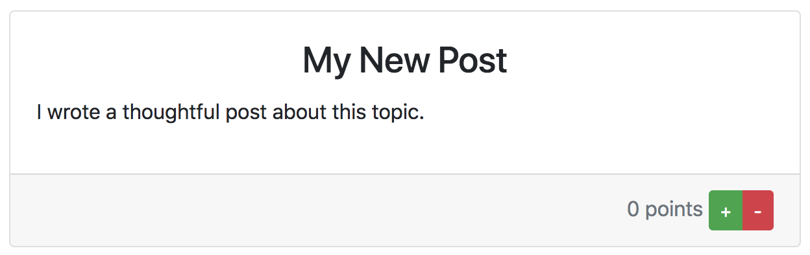
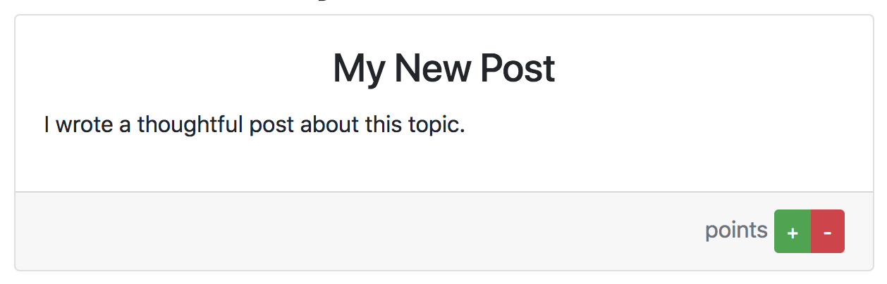

Our final step–and the main feature that separates Reddit from any other message board–is up-voting and down-voting posts. In this section, we will:

- Let users vote on posts
- Add points to our posts so we can keep track of their votes
- Sort posts by vote, so that the most popular posts are always at the top.

<!--
- add buttons to view
- store points on the model
- sort the posts by their point values
 -->

# Add Voting to Posts View

Let's start by adding up-vote and down-vote buttons to our posts. We want to add them so that our posts look like this:



>[action]
>
Our posts are rendered on our Rooms `show` view, so let's open `views/rooms/show.hbs`, and add voting buttons to every Post object inside the `{{#each}}...{{/each}}` loop. For styling, we'll use [Bootstrap's built in card footer](https://getbootstrap.com/docs/4.0/components/card/#header-and-footer). Add the following code:
>
```HTML
<!-- { ... Existing code ... } -->
>
<div class="row justify-content-center">
  <div class="col-8">
    {{#each posts as |post|}}
      <div class="card mb-3">
        <div class="card-body">
          <h3 class="card-title text-center">{{post.subject}}</h3>
          <p>{{post.body}}</p>
        </div>
>
        <!-- Add the following section: -->
        <div class="card-footer text-muted text-right">
          <span class="points-span">{{post.points}} points </span>
>
          <div class="btn-group btn-group-sm">
            <button type="button" class="btn btn-success">+</button>
            <button type="button" class="btn btn-danger">-</button>
          </div>
        </div>
>
      </div>
>
      <ul>
        {{#each post.comments as |comment|}}
          <li>{{comment.body}}</li>
        {{/each}}
        <li><a href="/rooms/{{../room.id}}/posts/{{post.id}}/comments/new">New comment</a></li>
      </ul>
>
    {{/each}}
>
  </div>
</div>
>
<!-- { ... Existing code ... } -->
```

These new buttons don't do anything yet, of course, because we haven't given them anything to do. We also won't get any value for our points:




# Add Points to Post Model

Let's add a `points` attribute to our Post model. With MongoDB, as opposed to traditional SQL databases, it isn't really _necessary_ to add attributes to our model. We can pass any attributes we like and MongoDB will happily save them for us.  However, adding the attributes to our Mongoose schema (by adding them to the model) lets us use more advanced functions, like querying and sorting our objects. This app is pretty simple, but as you write bigger apps, with more objects and more complex schemas, knowing how to use these features will become invaluable.

>[action]
>
Open the `models/post.js` file, and update it with the following:
>
```Javascript
const mongoose = require('mongoose');
const Schema = mongoose.Schema;
>
const PostSchema = new Schema({
  subject: String,
  body: String,
  room: { type: Schema.Types.ObjectId, ref: 'Room' },
>
  // Add this line:
  points: { type: Number, default: 0 },
});
>
module.exports = mongoose.model('Post', PostSchema);
```

Now you should see "0 points" on any Post.


# Posts Update Action

Now things get a little trickier–what happens when a user clicks on our new up/down-vote buttons? At the moment, nothing.  They have no assigned functions or values.

We need our up/down-vote buttons to send POST requests with the value of a user's vote, and then we can update the Post's `points` attribute accordingly.

>[action]
>
Open `views/rooms/show.hbs` and update the following code to make our +/- buttons full forms:
>
<!-- TODO: Make this work with bootstrap -->
```HTML
<form action="/rooms/{{post.room}}/posts/{{post.id}}" method="post" class="inline-form">
  <input type="hidden" name="points" id="post-points" value="-1">
  <button type="submit" class="downvote-button">-</button>
</form>
>
<form action="/rooms/{{post.room}}/posts/{{post.id}}" method="post" class="inline-form">
  <input type="hidden" name="points" id="post-points" value="1">
  <button type="submit" class="upvote-button">+</button>
</form>
```
>
Notice that both of these forms POST to the same endpoint–`/rooms/{{post.room}}/posts/{{post.id}}`. That address will call our posts `update` action (where we alter and save an existing object). Also notice that each of these forms will have a hard-coded value: The first is a form that always submits "-1", and the second always submits "1".

Now let's add an update action to our Posts controller.

>[action]
>
Open `routes/posts.js` and define an action for `.post('/rooms/{{post.room}}/posts/{{post.id}}', ...)`:
>
```Javascript
router.post('/:id', auth.requireLogin, (req, res, next) => {
  Post.findById(req.params.id, function(err, post) {
    post.points += parseInt(req.body.points);
>
    post.save(function(err, post) {
      if(err) { console.error(err) };
>
      return res.redirect(`/rooms/${post.room}`);
    });
  });
});
```
>
When we receive a request to this action, we first find the correct Post object. Then we add the value of `req.body.points` to the Post object's points – if the user clicked the "+" form we will add 1, increasing its points, and if the user clicked "-" we will add -1, decreasing its score.

# Sort Posts by Vote

Finally, let's set it up so that we see our top-voted posts at the top of the page. Because our view displays the posts in whatever order the controller sends them, we only need to add code in the controller that returns the posts already sorted by their points.

>[action]
>
Open the Rooms controller at `routes/rooms.js` and update the `show` action as below:
>
```Javascript
// Rooms show
router.get('/:id', auth.requireLogin, (req, res, next) => {
  Room.findById(req.params.id, function(err, room) {
    if(err) { console.error(err) };
>   
    //                       V Add the sorting action here
    Post.find({ room: room }).sort({ points: -1 }).populate('comments').exec(function (err, posts) {
      if (err) { console.error(err) };
>
      res.render('rooms/show', { room: room, posts: posts, roomId: req.params.id });
    });
  });
});
```

<!-- TODO: talk through code -->

# Conclusion

Congratulations! Try it out – you now have a working clone of Reddit!

Over the course of this tutorial, we set up an Express web server and configured it to use MongoDB as a database. We then created user accounts and built our own authentication system so they could log in and out. We used Handlebars as a templating engine to create dynamic HTML. We learned about MVC and REST then, using those principles, we built the models, views and controllers necessary for our user to make posts and comments. Finally, we added in voting so that comments could be sorted to feature the ones that the community thinks are most relevant.
